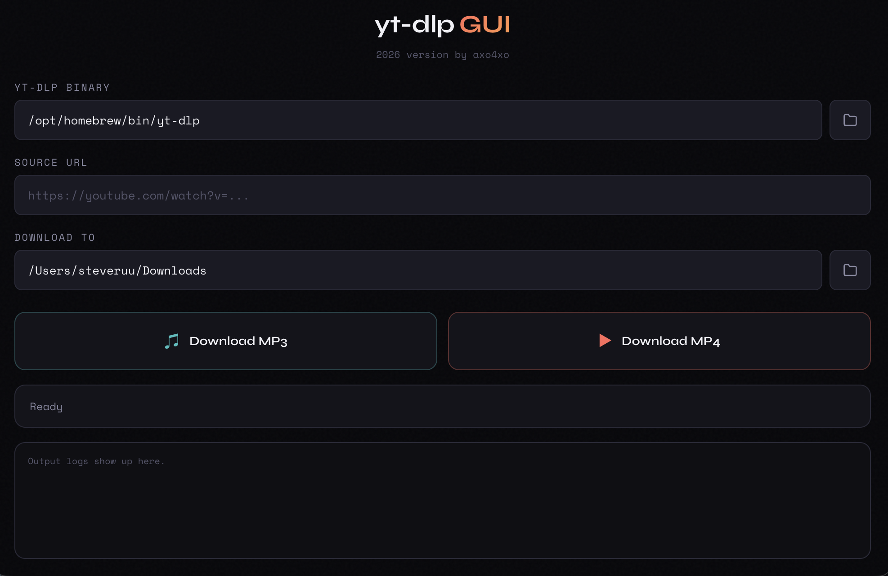

# yt-dlp-electron

an Electron wrapper for YT-DLP

- aims to replace [yt-dlp-downloader-winforms](https://github.com/axo4xo/yt-dlp-downloader-winforms)
- featuring a more modern design, and multiplatform support
- i just wanted to learn Electron and git



## prerequisites

- yt-dlp
- ffmpeg
- idk

### setup (macos)

```bash
brew install yt-dlp ffmpeg
```

### repo setup

```bash
npm install
npm run start
```
